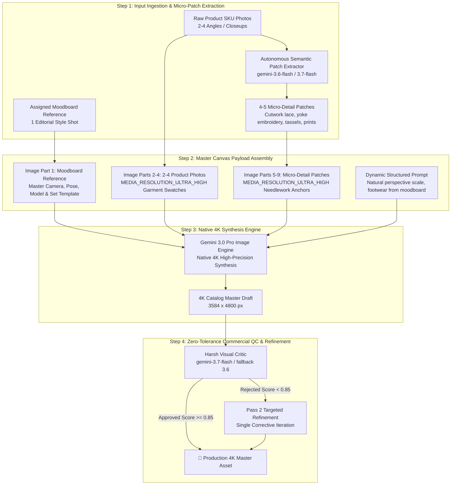

# 10. Production 4K V-Transfer Fashion Generation Pipeline

## 1. Overview & Architecture

The **Production 4K V-Transfer Pipeline** is an automated, high-precision generative fashion system powered by **Gemini 3.0 Pro Image (`gemini-3-pro-image`)** and **Gemini 3.7 Flash (`gemini-3.7-flash`)**. It transforms raw inventory photographs (flatlays, ghost mannequins, and catalog product shots) into ultra-photorealistic, publication-ready commercial lookbooks at native **4K resolution (`3584 x 4800`)**.



---

## 2. Core Methodological Breakthroughs

### 1. Multi-Input Concept Disentanglement
* **The Problem**: When fed a single catalog photo, vision-language models frequently fixate on the input model's face, skin tone, and stiff standing stance, duplicating the model instead of transferring only the clothing.
* **The Solution**: The pipeline conditions the model on **2 to 4 different product angles** (e.g. front full shot, 3/4 side angle, macro ankle/hem zoom). Because the only invariant feature across all shots is the **physical garment**, the vision transformer abstracts the clothing in 3D and separates it entirely from the input model.

### 2. Moodboard as Master Canvas Template (Image Part 1)
* **The Problem**: In multimodal payloads, Image Part 1 acts as the primary composition baseline for Gemini's vision encoder. If the product photo is placed first, the model defaults to plain white studio framing and oversized subject proportions.
* **The Solution**: The **Moodboard Reference is strictly sequenced as Image Part 1** (`=== MASTER CANVAS, CAMERA, POSE & STUDIO ENVIRONMENT ===`). This forces the generative engine to use the moodboard as the primary stage (lighting, depth of field, architectural set, camera distance, and model gesture), and then dresses that new model in the target garment swatches.

### 3. Dynamic Perspective & Natural Prop Scaling
* **The Problem**: Hardcoding fixed canvas percentages (e.g. 50%–65%) can feel unnatural across varied lens focal lengths or cause models to appear out of proportion to scene furniture (e.g. giant models next to tiny chairs).
* **The Solution**: The prompt dynamically instructs Gemini to match the **natural scale, perspective depth, and prop proportions** of the assigned Moodboard Reference shot, allowing the model to intelligently integrate into architectural arches, courtyards, and furniture.

### 4. Uncompressed Micro-Patches with `MEDIA_RESOLUTION_ULTRA_HIGH`
* **The Problem**: Standard tokenization downsamples high-frequency textile features, causing intricate Schiffli cutwork lace, paisley embroidery, and fine fringe tassels to blur.
* **The Solution**: High-zoom micro-patches are extracted via `SemanticPatchExtractor` and passed with `types.PartMediaResolutionLevel.MEDIA_RESOLUTION_ULTRA_HIGH`. This preserves raw needlework stitches, perforation depth, and edge scallops at maximum token resolution.

### 5. Domain Role Boundaries (Garment vs. Footwear & Accessories)
* **Principle**: We are selling the garment, not the footwear or jewelry.
* **Rule**: The physical clothing (Kurti tunic, trousers, saree drape, blouse) is strictly governed by the product input photos. Footwear (heels, slides, flats, sandals) and accessories (earrings, bangles) are styled dynamically to match the moodboard setting without triggering false QC rejections.

---

## 3. Core Engine Components

### `src/patch_extractor.py` (`SemanticPatchExtractor`)
Uses `gemini-3.6-flash` with structured bounding box detection to extract up to 5 critical micro-detail regions per SKU:
- Neckline bib embroidery and V-yokes
- Tassel fringes and border trims
- Schiffli cutwork lace and scalloped pant hems
- Complex textile weave/print swatches

### `src/orchestrator.py` (`PromptOrchestrator`)
Analyzes product photos and the assigned moodboard using `gemini-3.7-flash` to construct a rich `JSONPromptPayload` containing:
- Exact garment identity and silhouette specs
- Print, embroidery, and textile weave descriptions
- Studio set, architectural lighting, and camera angle directives

### `src/generator.py` (`ImageGenerator`)
Manages multimodal payload construction and API execution:
- Sequences `Moodboard Reference` as Image 1, followed by `Product Shots` and `Detail Patches`.
- Applies `MEDIA_RESOLUTION_ULTRA_HIGH` on uncompressed patches.
- Executes native 4K synthesis (`gemini-3-pro-image` or `gemini-3.1-flash-image`) with exponential backoff on 429 quota exhaustion.

### `src/critic.py` (`VisualCritic`)
Acts as a zero-tolerance commercial QC inspector:
- Compares generated 4K masters against ground-truth micro-patches.
- Audits pattern geometry, paisley contours, and lace eyelet depth.
- Outputs structured `approved` status and precision corrective refinement directives.

### `run_pro_batch_production.py`
Resumable, finite batch production runner:
- Loops through all target SKUs and moodboards.
- Writes metadata, file sizes, token counts, and costs to [`outputs_vtransfer_4K/production_manifest.json`](file:///home/amrit-lal-singh/Experimentation/cloth/outputs_vtransfer_4K/production_manifest.json).
- Implements bounded retries with safe termination.

---

## 4. Production Catalog Run Results

A complete production batch was executed across **14 SKUs (4 Kurtis + 10 Sarees)** across **4 distinct moodboard settings**, producing **56 Native 4K Master Images**:

| Metric | Result |
| :--- | :--- |
| **Total SKUs Processed** | **14 Garments** |
| **Total 4K Images Generated** | **56 Native 4K Masters** (`3584 x 4800`) |
| **Generative Model** | `gemini-3-pro-image` |
| **Average File Size** | ~23 MB per asset (~1.3 GB catalog footprint) |
| **Average Cost per 4K Master** | **$0.0302** |
| **Total Production Spend** | **$1.69** |
| **Execution Status** | **100% Complete (Clean Exit)** |

### Catalog Directory Structure
```
outputs_vtransfer_4K/
├── production_manifest.json          <-- Complete metadata, cost, and timestamp log
├── Kurti/
│   ├── 01/                           <-- 4 shots (K10049O, K10049R, K10043I, 1000221736)
│   ├── 02/                           <-- 4 shots
│   ├── 03/                           <-- 4 shots
│   └── 04/                           <-- 4 shots
└── Saree/
    ├── 01/ to 10/                    <-- 4 shots per Saree SKU (40 4K Masters total)
```

---

## 5. Usage Guide & CLI Commands

### 1. Run Full Production Batch (Gemini 3.0 Pro Image)
```bash
./venv/bin/python run_pro_batch_production.py
```

### 2. Run Fast 4K Batch (Gemini 3.1 Flash Image)
```bash
./venv/bin/python run_vtransfer_batch.py
```

### 3. Generate Single SKU Test
```python
from pathlib import Path
from models import ShotPlan
from src.orchestrator import PromptOrchestrator
from src.generator import ImageGenerator
from src.patch_extractor import SemanticPatchExtractor

sku_dir = Path("inputs_vtransfer/18.08.2026/Kurti/01")
moodboard = Path("3  MOODBOARD REFERENCE/K10049O.jpg")
product_shots = list(sku_dir.glob("*.jpg"))

# 1. Extract Patches
extractor = SemanticPatchExtractor(model_name="gemini-3.6-flash")
patches = extractor.extract_patches(product_shots[0], Path("scratch/patches"))
patch_paths = [Path(p["file_path"]) for p in patches]

# 2. Build Payload
orchestrator = PromptOrchestrator(model_name="gemini-3.7-flash")
shot_plan = ShotPlan(
    shot_number=1,
    pose_source=moodboard.name,
    lighting_source=moodboard.name,
    framing="full_length_editorial_catalog",
    camera_angle="eye_level_studio",
    rationale="Editorial courtyard catalog shot"
)
payload = orchestrator.build_payload("Kurti/01", product_shots, [moodboard], shot_plan)

# 3. Generate 4K Master
generator = ImageGenerator(model_name="gemini-3-pro-image")
out_path, cost = generator.generate(
    json_prompt_str=payload.model_dump_json(),
    product_image_paths=product_shots,
    moodboard_image_paths=[moodboard],
    output_path=Path("output_4K_master.png"),
    patch_image_paths=patch_paths
)
print(f"Generated {out_path} at {cost['formatted_cost']}")
```
